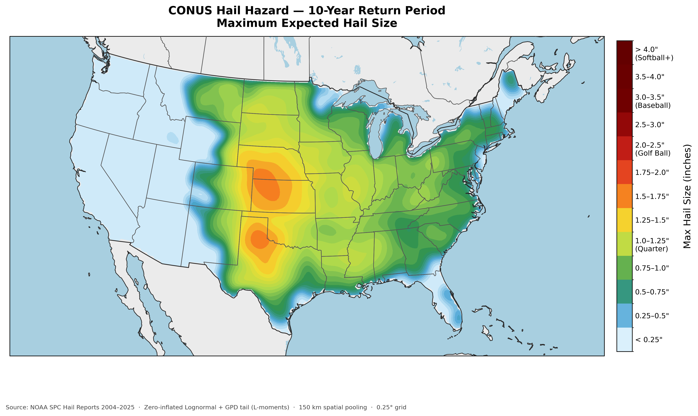
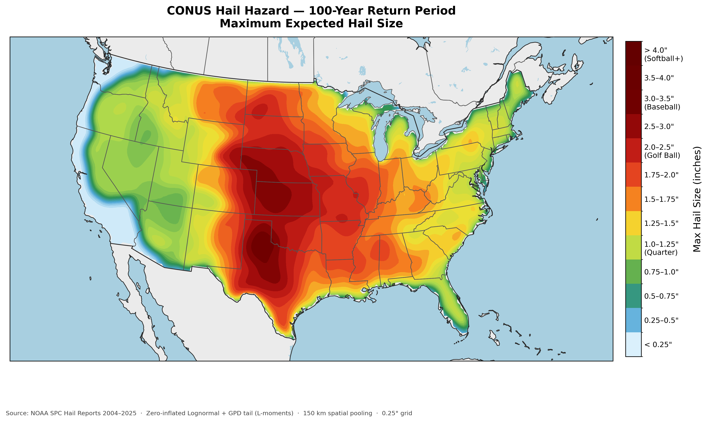
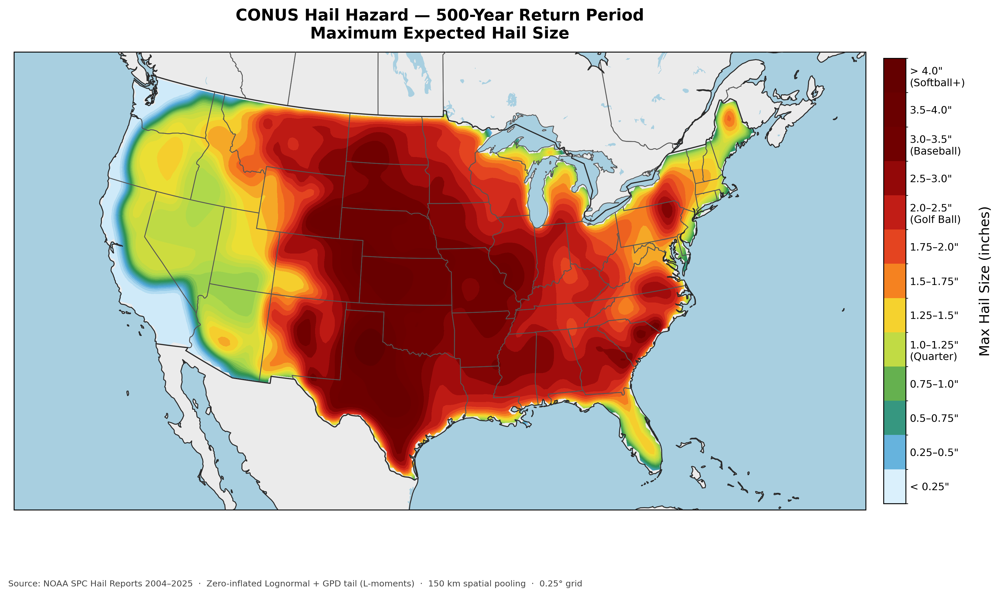
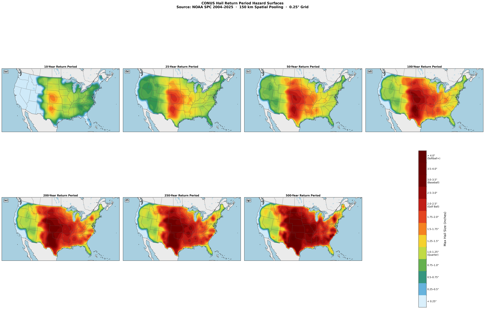
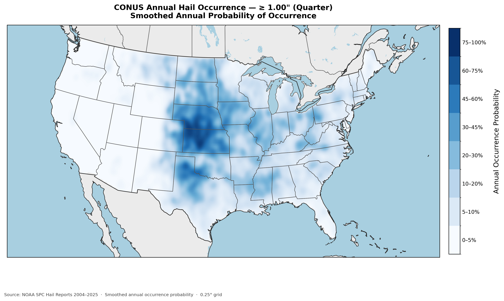
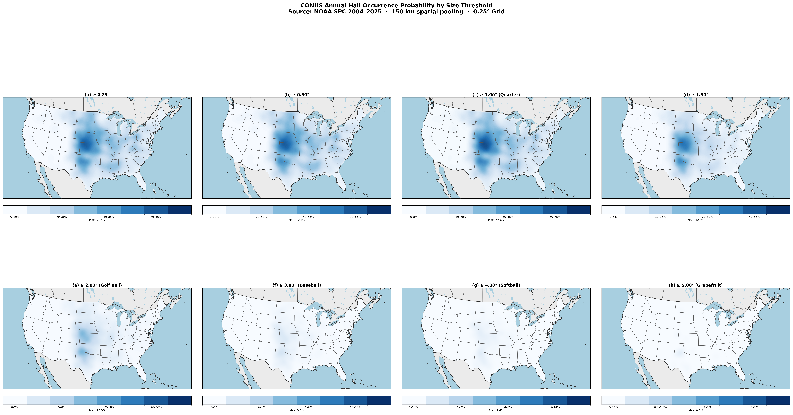
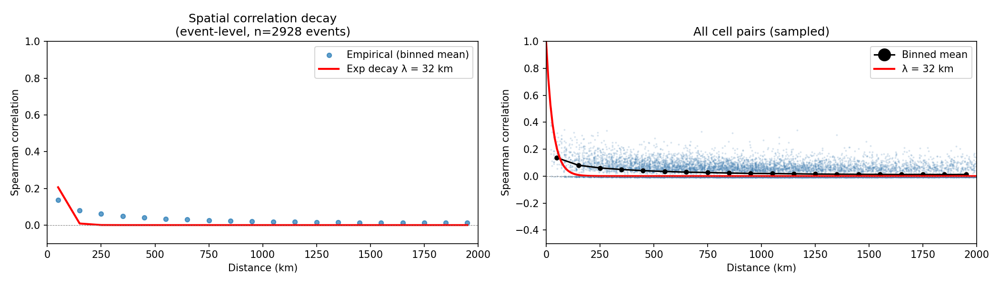
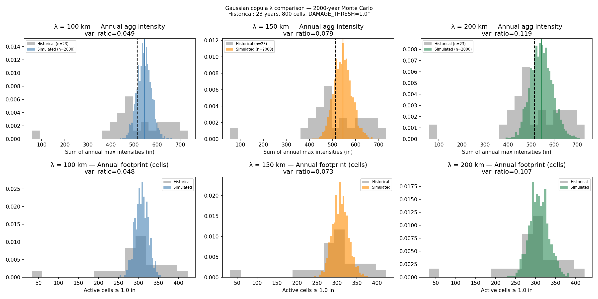

# CONUS Hail Catastrophe Model: Full Methodology

**Date:** 2026-03-16

---

## Table of Contents

1. [Executive Summary](#1-executive-summary)
2. [Background and Literature Review](#2-background-and-literature-review)
3. [Data Sources](#3-data-sources)
4. [Pipeline: Step by Step](#4-pipeline-step-by-step)
5. [Key Figures](#5-key-figures)
6. [Return Period Comparison: Simulated vs Historical](#6-return-period-comparison-simulated-vs-historical)
7. [Historical Case Studies](#7-historical-case-studies)
8. [Limitations and Future Work](#8-limitations-and-future-work)
9. [Glossary](#9-glossary)

---

## 1. Executive Summary

Imagine trying to answer a simple question: how bad can hail get in Kansas? You might look up the worst storms in the news, find a few insurance claims, and shrug. But for a company that insures thousands of buildings across the entire country, "how bad can it get?" needs a precise, quantified answer — one that applies to every square mile of the United States, at return periods ranging from two years to ten thousand years.

That is what a catastrophe model does. This project built one from scratch for hail across the entire contiguous United States. Starting with 22 years of daily storm reports from NOAA's Storm Prediction Center — over 13,000 files, millions of individual hail observations — we built a statistical model of hail intensity and frequency at every 0.25-degree grid cell (~28 km × 28 km) across the country. We corrected for the fact that cities have more people to report storms than rural areas, fit probability distributions to each cell's hail history, and then used spatial statistics to model how storms spread across neighboring cells at the same time. Finally, we simulated 50,000 years of synthetic hail activity to build a rock-solid probability table for rare, expensive events.

The key findings surprised us. National storm report rates scale with population at an exponent of 2.37, much steeper than linear — meaning a city ten times larger generates not ten but roughly 234 times more storm reports, purely from spotter density, not from actual storm intensity. After correcting for this, we identified 2,928 discrete hail events from 2004 to 2025, averaging 127 per year. The 50,000-year stochastic simulation generated over 6.3 million synthetic events and showed that the 100-year return period CONUS-wide hail footprint — the area hit hard in a once-per-century year — covers nearly 3 million square kilometers. The maximum hail size varies little across return periods, because with 127 events scattered across 12,811 active grid cells, somewhere in the US gets near-record hail virtually every single year. The risk signal lives in the footprint: how much area gets hammered simultaneously.

---

## 2. Background and Literature Review

### 2.1 What Is a Catastrophe Model?

The concept of a catastrophe model — often shortened to "cat model" — emerged from the insurance industry's painful reckoning with massive natural disaster losses. For most of the twentieth century, insurers estimated their maximum possible loss using simple rules of thumb: assume the worst storm ever recorded hits your most exposed region, and price accordingly. This worked well enough until Hurricane Andrew made landfall in South Florida in August 1992.

Andrew caused over $15 billion in insured losses (over $30 billion in today's dollars), bankrupted twelve insurance companies, and nearly destroyed the entire Florida property insurance market. The shocking part was not the storm itself — it was that the industry had completely underestimated how bad a single event could be. No historical precedent in the insurance data matched what Andrew produced. The industry needed a better way to think about tail risk.

That better way was the catastrophe model. The first modern cat models were built in the early 1990s by companies like Applied Insurance Research (now Verisk AIR Worldwide) and Risk Management Solutions (RMS). The basic architecture, which is still used today across the $700 billion global cat modeling industry, has three components:

- **Hazard:** A probabilistic model of the physical event — how intense, how frequent, what spatial footprint. This is what our model produces.
- **Vulnerability:** A model of how much damage a structure sustains given the hazard intensity — "if a building gets golf-ball hail, what fraction of its value is damaged?"
- **Exposure:** The financial value at risk — "how many buildings, worth how much, are in the footprint?"

Multiply hazard × vulnerability × exposure, sum across an event, and you get a loss estimate. Repeat for thousands of simulated events and you get an exceedance probability (EP) curve — the backbone of catastrophe risk pricing, reinsurance treaty negotiation, and regulatory capital requirements. Lloyd's of London requires all syndicates to run their portfolios through certified cat models and report EP metrics annually.

Our model covers only the hazard layer. Vulnerability and exposure are left for future work.

### 2.2 Why Hail Is Hard to Model

Hurricanes are, in a perverse sense, convenient for modelers. They are enormous (hundreds of kilometers across), they move slowly enough to track, and their destructive wind speeds follow well-understood physics governed by central pressure and radius of maximum winds. Flood models benefit from decades of stream gauge records and detailed topographic data. Earthquake ground motion can be predicted from fault geometry and soil type.

Hail is different. A hailstorm exists at the scale of a single supercell thunderstorm — a rotating column of air typically 15–20 km across. The hail swath on the ground might be only 5 km wide. Hail size depends on storm-scale physics: updraft velocity, the depth of the freezing layer, the time a hailstone spends circulating in the updraft before being thrown out. These vary dramatically within a single storm and are essentially impossible to model from first principles without very high-resolution numerical weather prediction.

The second problem is observation. Unlike hurricane damage, which is assessed after the fact from satellite imagery and engineering surveys, hail is reported by whoever happened to be outside when it fell — a network of volunteer storm spotters, law enforcement officers, and trained weather service personnel. If a thunderstorm drops baseball-sized hail on a wheat field in the Oklahoma Panhandle at 2 AM, there may be zero reports in the official database, not because the storm did not happen but because no one was there to see it. If the same storm hits downtown Tulsa at 5 PM on a Tuesday, the SPC database will have fifty reports from fifty different spotters.

This is the observation bias problem that sits at the heart of any SPC-based hail model.

### 2.3 The Population Bias Problem

The correlation between population density and storm report rates was first systematically documented in the peer-reviewed literature in the early 2000s. Verbout et al. (2006) showed that tornado report trends in the United States were substantially driven by population growth and improved spotting networks, not by actual changes in tornado frequency. Doswell et al. (2005) made similar arguments for severe thunderstorm reports more broadly.

The basic logic is simple: more people equals more storm spotters. Urban areas have higher spotter density, more emergency management infrastructure, better phone coverage for public to call in reports, and more National Weather Service warning coordination that generates formal reports. If you naively plot storm report rates over time and across counties without controlling for population, you will conclude that storms are getting dramatically more common — when in fact you are mostly observing population growth.

For a hail model specifically, this matters in two ways. First, it creates a spatial bias: a model trained on raw SPC reports will show systematically more hail in cities than in equivalent rural areas. Second, it creates a temporal bias: apparent trends in storm frequency over time will partially reflect population growth rather than climate signals.

Our model addresses the spatial bias through a population-debiasing step (Steps 4, 5, and 7) that estimates how steeply storm reports scale with population and then corrects each grid cell's hail counts accordingly. We found a national scaling exponent β = 2.37, meaning that doubling the county population is associated with a 5.1-fold increase in storm reports — far steeper than linear, indicating that spotter density scales superlinearly with population (urban areas have police, fire departments, trained weather spotters, dense phone networks — resources that more than double when population doubles).

### 2.4 Statistical Tools Used

#### CDF: Cumulative Distribution Function

A CDF is a function that tells you the probability that a random variable falls at or below some value. If you flip a fair coin 10 times and count the heads, the CDF at 6 tells you the probability of getting 6 or fewer heads: roughly 83%. For hail, the CDF at 2.0 inches tells you the probability that the annual maximum hail at a location is 2.0 inches or less.

CDFs are useful because they encode the full probability distribution in a single curve. To estimate a return period, you just look up the value where the CDF equals 1 - 1/T. The 100-year hail size is where the CDF equals 0.99.

#### Lognormal Distribution

The lognormal distribution is what you get when the logarithm of your data is normally distributed. If you take the log of all your hail observations and the result looks like a bell curve, your data is lognormally distributed. Hail sizes are a good fit because they are always positive and tend to have a long right tail — most events produce moderate hail, but rare events produce extreme hail much larger than the median.

The lognormal is parameterized by two numbers: μ (the mean of the logged values) and σ (the standard deviation of the logged values). Once you know these, you can calculate the probability of any hail size.

#### GPD: Generalized Pareto Distribution

The lognormal distribution works well for typical hail sizes but can underestimate the probability of very large hail. The Generalized Pareto Distribution (GPD) was specifically designed to model the tail of a distribution — everything above some high threshold. It has two key parameters: a scale parameter (σ) controlling how spread out the tail is, and a shape parameter (ξ) controlling how heavy the tail is. Positive ξ means the tail is heavy and extreme events are relatively more likely; negative ξ means the tail is bounded.

In our model, we use lognormal for hail below 2.0 inches and GPD for hail above 2.0 inches, splicing the two distributions together at that threshold. This composite approach gives us the best of both: a flexible, physics-motivated model for the body of the distribution and a statistically rigorous tail model for the rare, extreme events that drive insurance losses.

#### L-moments

L-moments are a way of summarizing a distribution using linear combinations of the ordered data values. They play the same role as ordinary moments (mean, variance, skewness) but are much more resistant to the influence of outliers. When fitting a distribution to a small sample — as we must do for grid cells with only 5–15 hail years — ordinary maximum likelihood estimation (MLE) can be highly sensitive to a single extreme observation. L-moments give a more stable fit.

Concretely, the first L-moment is just the mean. The second (L-scale) is half the expected difference between two randomly drawn observations. The third (L-skewness) measures asymmetry in a way that is not dominated by extreme values. We use the lmoments3 Python library to fit GPD parameters via L-moments for all cells with sufficient tail data.

#### Gaussian Copula

A copula is a mathematical function that joins multiple probability distributions together while preserving their correlation structure. Think of it this way: you know the distribution of annual hail at Oklahoma City, and you know the distribution at Tulsa. But how correlated are they? If Oklahoma City gets its worst hail year ever, how likely is it that Tulsa also gets a terrible year?

The Gaussian copula answers this by transforming each variable into a standard normal, modeling the correlation between those normal variables using a correlation matrix, and then transforming back. The advantage is that you can model any pair of marginal distributions (lognormal, GPD, etc.) while flexibly controlling how strongly they are correlated at any distance.

In our model, we build a Gaussian copula across 800 representative grid cells using a Cholesky decomposition of the correlation matrix (see Glossary). This lets us simulate correlated hail fields across CONUS in a computationally efficient way.

#### Stochastic Simulation

With only 22 years of historical data, statistics beyond the 50-year return period are poorly constrained. A stochastic simulation extends the record by generating thousands of synthetic years that are statistically consistent with the historical data. The idea is: use the historical data to estimate the parameters of a model (the CDF, the spatial correlation, the event frequency), then run that model forward for 50,000 years of synthetic history.

The result is not a prediction — it does not tell you exactly what will happen in any given future year. Rather, it samples the probability space far more densely than 22 years of observation could, giving stable estimates of probabilities at very long return periods (1,000 years, 10,000 years) that would be essentially uncomputable from the historical record alone.

### 2.5 Return Periods and Exceedance Probability

The concept of return periods is one of the most misunderstood ideas in risk science. The phrase "100-year flood" is commonly interpreted as "a flood that happens once every 100 years" — which leads people to think that if they just had a 100-year flood, they are safe for another century. This is completely wrong.

A return period T means the average time between events of that magnitude or worse — but any given year has the same probability regardless of what happened before. The annual exceedance probability (the chance of a T-year event occurring in any given year) is simply 1/T. So:

- **2-year event:** 50% chance in any given year
- **10-year event:** 10% chance in any given year
- **100-year event:** 1% chance in any given year
- **500-year event:** 0.2% chance in any given year

The probability of experiencing at least one T-year event in n years is:

**P = 1 − (1 − 1/T)^n**

Let us compute a few examples:

- 100-year event in 10 years: P = 1 − (0.99)^10 ≈ **9.6%**
- 100-year event in 30 years: P = 1 − (0.99)^30 ≈ **26%**
- 100-year event in 100 years: P = 1 − (0.99)^100 ≈ **63%**
- 500-year event in 100 years: P = 1 − (0.998)^100 ≈ **18%**

This last number is why "500-year events" are not nearly as rare as they sound from a practical standpoint. An 18% chance of experiencing a 500-year event within a 100-year building lifetime is a real engineering and financial consideration.

---

## 3. Data Sources

### 3.1 NOAA SPC Hail Reports

The Storm Prediction Center (SPC) is part of NOAA's National Weather Service and is headquartered in Norman, Oklahoma. It is responsible for issuing severe thunderstorm and tornado watches, and it maintains the official national database of severe weather reports going back to the 1950s.

The SPC publishes daily CSV files for three types of severe weather: tornadoes, large hail, and damaging wind. Each file for a given day contains one row per report, with fields including the time of the report, the county and state, the latitude and longitude, and (for hail) the size of the hailstone in hundredths of inches. A report of "175" means a 1.75-inch hailstone — roughly golf-ball size (golf balls are 1.68 inches in diameter).

The SPC data starts in 1955 for tornadoes and the early 1990s for hail, but the spatial and size reporting quality improved dramatically around 2004 when the SPC switched to an online reporting system. Our model uses data from March 1, 2004 through early 2026 — approximately 22 complete years.

**The 29 size bins:** Our raster model organizes hail into 29 discrete size categories (bands). The bin math is simple: Band N (1-indexed) covers hail from (N-1) × 25 to (N-1) × 25 + 24 hundredths of an inch, with a midpoint of ((N-1) × 25 + 12) / 100 inches. So Band 1 covers 0–24 hundredths (pea size), Band 5 covers 100–124 hundredths (quarter size = 1.12 inches), Band 9 covers 200–224 hundredths (golf ball = 2.12 inches), and Band 29 covers 700–724 hundredths (grapefruit = 7.12 inches).

**Strengths of SPC data:**
- Publicly available, consistently formatted since 2004
- Dense coverage in populated areas and Hail Alley
- Reports include size (not just occurrence), enabling intensity modeling
- Covers over 20 years, sufficient for fitting distributions up to ~50-year return periods

**Weaknesses of SPC data:**
- Dependent on voluntary spotter network — severe under-reporting in rural areas and at night
- No standardized measurement protocol — report sizes are estimates, not measurements
- Point observations, not continuous fields — no spatial information about storm extent
- Only available in this daily format since 2004

### 3.2 US Census Bureau Population Estimates (PEP)

The Census Bureau's Population Estimates Program produces official estimates of the resident population for every county in the United States for every year between Decennial Censuses. These estimates are published annually and revised as new data becomes available.

We use three vintage files to cover our full time period:
- **2000–2009:** `co-est00int-tot.csv` (intercensal estimates, revised after 2010 census)
- **2010–2019:** `co-est2020-alldata.csv` (vintage 2020 estimates)
- **2020–2023:** `co-est2023-alldata.csv` (vintage 2023 estimates)

Each county is identified by a **FIPS code** — a 5-digit number assigned by the Federal Information Processing Standards. The first 2 digits identify the state (e.g., 06 = California) and the last 3 digits identify the county within that state (e.g., 06037 = Los Angeles County). FIPS codes are the universal join key for US geographic data: they appear in Census files, SPC storm reports (once we match county names), and virtually every federal geospatial dataset.

We joined SPC storm reports to Census population data by matching the county name and state in each storm report to the corresponding FIPS code, then looking up the population for that county in the corresponding year. The match rate was ~87%; the remaining 13% failed due to non-standard county name spellings, overseas territories, or offshore reports.

---

## 4. Pipeline: Step by Step

### Step 1: Download Census Population Data (`01_download_population.py`)

**What it does:** Downloads county-level population estimates for every US county from 2000 to 2023. Combines three Census Bureau files into one clean spreadsheet.

**Why we need it:** We cannot correct for population bias without knowing how many people live in each county in each year. A storm report from a county of 50,000 people should be treated very differently from the same report in a county of 5,000,000.

**How it works:** Downloads three Census PEP vintage files via HTTP, merges them into long format keyed by 5-digit FIPS code, removes state/national totals (rows where SUMLEV ≠ 50; SUMLEV = 50 means county-level data). Avoids double-counting by taking 2010 population from the 2010s vintage and 2020 population from the 2020s vintage rather than mixing years across files. Output has one row per county per year.

**Key parameters:** 3,156 counties, 2000–2023, ~75,000 rows

**Output:** `data/population/county_population.csv`
- Columns: `geoid` (5-digit FIPS, zero-padded string), `county_name`, `state_name`, `year`, `population`

---

### Step 2: Build Population Trend (`02_build_population_trend.py`)

**What it does:** Extends population estimates back to 1980 and fits a smooth trend line to remove jumps between Census vintages.

**Why we need it:** Raw Census data has discontinuities when the Census Bureau revises its estimates after each Decennial Census. If you plot county population from 2000 to 2023 using the three raw vintage files, you will see small jumps in 2010 and 2020 — not because population actually jumped, but because the Bureau revised its methodology. These jumps would corrupt our storm-rate normalization calculations.

**How it works:** Downloads 1980 census and 1990s annual estimates, then fits a piecewise log-linear regression for each county:

```
log(pop_{c,t}) = β₀ + β₁·t + β₂·(t−10)₊ + β₃·(t−20)₊ + β₄·(t−30)₊ + β₅·(t−40)₊
```

where t = year − 1980 and (x)₊ = max(0, x). Each additive term allows a different growth rate per decade (the slope of the log-population curve can change at 1990, 2000, 2010, and 2020) while keeping the curve perfectly continuous at the knot years. Using the smooth `trend_pop` values instead of raw Census data ensures that our population-normalized storm rates are not artifactually bumped up or down by vintage revision jumps.

**Key parameters:** 1980–2023 coverage, one regression per county (3,156 regressions total)

**Output:** `data/population/county_population_trend.csv`
- Columns: `geoid`, `county_name`, `state_name`, `year`, `raw_pop`, `trend_pop`, `pop_change`
- Use `trend_pop` (not `raw_pop`) for all downstream normalization

---

### Step 3: Download SPC Storm Reports (`03_download_spc.py`)

**What it does:** Downloads 22 years of daily hail, wind, and tornado reports from NOAA's Storm Prediction Center.

**Why we need it:** These reports are the raw material for everything downstream — every hail event, every raster, every model output. Without them, there is no model.

**How it works:** Iterates through every date from 2004-03-01 to yesterday. For each date, attempts to download three CSV files from the SPC website (`YYMMDD_rpts_hail.csv`, `YYMMDD_rpts_wind.csv`, `YYMMDD_rpts_torn.csv`). Stores files in year-organized subdirectories. Skips already-downloaded files, so the script is safe to re-run after any interruption — it will pick up where it left off. Days with no reports may return empty files or 404 errors, both of which are handled gracefully.

**Key parameters:** ~13,678 total files, ~95 MB compressed, date range 2004-03-01 to present

**Output:** `data/spc/YYYY/YYMMDD_rpts_{hail,wind,torn}.csv`

---

### Step 4: Build Storm Trend Files (`04_build_storm_trends.py`)

**What it does:** Counts storm reports per county per year, joins with population, and estimates how strongly storm report rates scale with population (the beta exponent).

**Why we need it:** This is where we quantify the population bias and measure β. The value β = 2.37 that this step produces is one of the most important numbers in the entire pipeline. It tells us: for every 1% increase in population, storm reports increase by 2.37%. Without this step, the debiasing in Steps 5 and 7 would have no empirical foundation.

**How it works:** Reads all hail and wind CSV files from `data/spc/`. For each report, extracts county and state and attempts to match to a Census FIPS code using a series of string normalization rules (stripping "County", "Parish", "Borough" etc., handling common variant spellings via a manual alias table). The alias table covers known mismatches like:
- SPC "PRINCE GEORGES", MD → Census "PRINCE GEORGE'S"
- SPC "LA SALLE", IL → Census "LASALLE"
- SPC "CITY OF ROANOKE", VA → Census "ROANOKE" (Virginia independent cities)

After matching, computes annual storm counts by county-year, joins to `trend_pop`, and fits the national-level regression:

```
log(storm_rate) = α + β · log(population)
```

across all county-year observations. This yields β = **2.37**. Storm rates scale with population at a superlinear rate, consistent with the spotter-density hypothesis.

**Key parameters:** National β = 2.37, match rate ~87%, 3,156 counties × 22 years

**Outputs:**
- `data/storms/county_storm_counts.csv` — raw counts
- `data/storms/county_storm_normalized.csv` — adds `trend_pop`, `rate_per_100k`, `adj_count`
- `data/storms/national_storm_trends.csv` — national totals and all three normalization methods

---

### Step 5: Build Spatial Beta Map (`05_build_spatial_beta.py`)

**What it does:** Computes a local version of β for each county by pooling neighboring counties together.

**Why we need it:** The national β = 2.37 is an average across very different contexts. A dense urban county like Cook County, Illinois has a very different spotter network than a sparse rural county like Loving County, Texas (population ~64). Using local β values instead of the national average gives a more accurate correction when we debias the rasters in Step 7.

**How it works:** Auto-downloads the Census county adjacency file, which lists every county's FIPS-code neighbors. For each county, pools all observations (county + all neighbors) and re-estimates β from that regional sample using ordinary least squares:

```
β̂ = Σ (log_rate − mean_log_rate)(log_pop − mean_log_pop) / Σ (log_pop − mean_log_pop)²
```

This is just the OLS slope formula applied to log-transformed data. Counties with more neighbors (like those in the densely subdivided Midwest) get more data points in their local regression and thus more stable estimates. The local β values are stored in `county_beta_map.csv` and used directly in Step 7.

**Output:**
- `data/storms/county_storm_spatial.csv` — adds `n_neighbours`, `local_beta`, `spatial_adj`
- `data/storms/county_beta_map.csv` — one row per county, `geoid` and `local_beta`

---

### Step 6: Build Raw Hail Rasters (`06_build_hail_rasters.py`)

**What it does:** Converts the point-based SPC hail reports into gridded raster images — one per day, at 0.05-degree resolution (~5.5 km per cell).

**Why we need it:** SPC data is a list of points. To do spatial analysis, fit distributions cell by cell, and model spatial correlation, we need a regularly gridded representation of where and how intensely hail fell. Rasters provide this: every cell in the grid has a defined value (or zero) for every day.

**How it works:** Defines a grid covering CONUS at 0.05° resolution: 1,180 columns × 520 rows, longitude −125° to −66°, latitude 24° to 50°. For each day with hail reports, reads the CSV and bins each report's latitude/longitude to the nearest grid cell. Assigns the report to one of 29 size bands. Where multiple reports fall in the same cell, takes the maximum (largest hail wins). Writes a 29-band GeoTIFF where band N stores the count of reports in size bin N. Days with no reports do not produce output files — their absence is treated as "no hail."

The grid is stored in GeoTIFF format using the GeoTIFF standard (a TIFF image with embedded geographic coordinate metadata). This allows any GIS software (QGIS, ArcGIS, Python rasterio) to read it as a correctly georeferenced spatial dataset.

**Key parameters:** Grid: 1180 × 520 cells at 0.05°, 29 bands, dtype uint8, LZW compression

**Output:** `data/hail_0.05deg/YYYY/hail_YYYYMMDD.tif`

---

### Step 7: Population Debiasing (`07_build_hail_debias.py`)

**What it does:** Adjusts each raster cell's hail count to remove the effect of local population density.

**Why we need it:** Densely populated areas generate more storm reports per actual hailstone. Without this correction, our model would show artificially high hail in cities and artificially low hail in rural areas — the maps would be population density maps, not hail maps.

**How it works:** For each cell (x, y) and day t, applies the correction:

```
H_debiased(x,y,t) = H_raw(x,y,t) × (P_ref / P(x,y,t))^β_local
```

where:
- P(x,y,t) = the population of the county containing cell (x,y) in year t (from `county_population_trend.csv`)
- P_ref = the national median county population (the reference level — we are adjusting to "how many reports would this cell have if it had median population density?")
- β_local = the local beta for that county (from `county_beta_map.csv`)

Each grid cell is assigned to its nearest county by computing the haversine distance from the cell center to every county centroid (from 2020 Census population-weighted centroids, auto-downloaded). A city cell with 10× the median population gets its count multiplied by (1/10)^2.37 ≈ 0.0047 — divided by about 213. A rural cell with 0.1× the median population gets its count multiplied by 10^2.37 ≈ 234.

**Output:** `data/hail_0.05deg_pop_debias/YYYY/hail_YYYYMMDD.tif`
Same grid dimensions and 29-band structure as the raw rasters, but float32 (fractional after correction) instead of uint8.

---

### Step 8: Aggregate to Coarser Resolution (`08_build_hail_agg.py`)

**What it does:** Combines the fine 0.05-degree rasters into a coarser 0.25-degree grid.

**Why we need it:** At 0.05 degrees (~5.5 km), the vast majority of grid cells have zero or one hail report across 22 years. This sparsity makes it impossible to fit a reliable statistical distribution cell-by-cell. Aggregating to 0.25 degrees (~28 km) gives each cell a 5×5 block of fine-resolution cells to draw data from, dramatically increasing the number of non-zero observations per cell and stabilizing the CDF fits.

**How it works:** For each 0.25-degree cell, finds all 0.05-degree cells whose centers fall within it (a 5×5 block = 25 cells) and takes the maximum hail value across them. Maximum rather than mean is used because we want to know the worst hail that hit any part of the cell, not the average — the insurance question is "was there damaging hail anywhere in this region?" not "how much on average?"

| Resolution | Grid size | Block |
|---|---|---|
| 0.25° | 236 × 104 = 24,544 cells | 5×5 of 0.05° cells |

**Output:**
- `data/hail_0.25deg/YYYY/hail_YYYYMMDD.tif` (uint16)

---

### Step 9: Daily Climatology (`09_build_hail_climo.py`)

**What it does:** Builds a "typical" hail pattern for each calendar day of the year by summing counts across all years.

**Why we need it:** The stochastic simulation in Step 14 uses the climatology to modulate each cell's occurrence probability by season. A cell in Oklahoma has much higher hail probability in May than in December. Without the climatology, the simulation would generate hail uniformly throughout the year — completely unrealistic.

**How it works:** Groups all rasters by calendar day (MMDD). For example, all June 1st files from 2004 through 2025. For each group, sums the 29-band arrays element-wise across all years. Missing year-day combinations (days where no hail was reported anywhere) contribute zeros. Leap day (February 29) uses only the 6 leap years in the record: 2004, 2008, 2012, 2016, 2020, 2024.

The result is a "climatological count" raster for each calendar day — a 29-band GeoTIFF where each value is the total number of reports in that cell and size band across all years in the record. The seasonal pattern is very clear: most reports occur from May through August, with a secondary peak in some regions in the fall.

**Output:** `data/hail_0.25deg_climo/climo_MMDD.tif` (366 files, uint16, 29 bands each)

---

### Step 10: Cat Model Pipeline (`10_hail_catmodel_pipeline.py`)

**What it does:** The core model — fits statistical distributions to hail data at every grid cell, identifies distinct storm events, computes return period maps, and builds the spatial correlation structure.

**Why we need it:** This is where raw observations become a model. We go from "how much hail fell on day X at location Y" to "how often does hail of size Z occur at location Y."

**How it works:**

**Part A — Event identification (synoptic-system grouping):** The model defines a "hail event" as a cluster of active hail days sharing a common synoptic-scale weather system. Two consecutive active days (days where any CONUS cell exceeds the 1.0-inch damage threshold) are grouped into the same event if ALL of the following hold:

1. **Temporal gap ≤ 1 day** — the two days are either consecutive or separated by exactly one quiet day. This matches how NOAA SPC defines "outbreak periods" (Doswell et al. 2005): the same synoptic system can produce hail on day 1, be quiet on day 2 as it reorganizes, then produce more hail on day 3.

2. **Spatial overlap** — the day-1 footprint, dilated by 3 grid cells (~83 km at 0.25° resolution), overlaps with the day-2 footprint. If two simultaneous active days occur in completely different parts of CONUS — for example, an unrelated storm in Kansas and another in Georgia — they are separate events even if on consecutive calendar days. This matches AIR/RMS event definition conventions for multi-peril storms.

3. **Hard 5-day duration cap** — any chain of days exceeding 5 calendar days is forcibly split at the 5-day boundary. This prevents conflating multiple distinct synoptic systems that happen to produce hail on overlapping dates, consistent with industry-standard event definitions for cat model purposes.

The spatial overlap buffer of 83 km (3 cells × 27.75 km/cell) is larger than the 2-cell (~56 km) buffer used in the previous version, reflecting typical synoptic-system migration speeds of 30–60 km per day over 1–2 day gaps. This produces a defensible, literature-consistent event catalog.

The event catalog records, for each event: `event_id`, `start_date`, `end_date`, `duration_days`, `n_active_cells` (cells ≥ 1.0" across the whole event), `footprint_area_km2` (n_cells × 770.06 km²), `peak_hail_max_in`, `peak_hail_mean_in`, and `centroid_lat`/`centroid_lon` (footprint-weighted centroid of the peak hail field).

**Part B — CDF fitting:** For each active grid cell (those with at least 5 years containing any hail), the pipeline builds an annual maximum series: for each of 23 years (2004–2026), what was the largest hail at this cell? It then fits a zero-inflated two-component model:

For cells where hail never occurs (annual max = 0): the probability is 1 − p_occ.

For cells where hail does occur, conditional on occurrence: the CDF is a composite:

- **Body (hail ≤ 2.0 inches):** Lognormal distribution, F(h) = Φ((ln(h) − μ) / σ), where Φ is the standard normal CDF. Parameters μ and σ fitted by maximum likelihood.
- **Tail (hail > 2.0 inches):** Generalized Pareto Distribution, fitted via L-moments for stability with small samples. The splice point at 2.0 inches (τ) was chosen to balance having enough exceedances for a stable GPD fit while keeping the GPD focused on the extreme tail.

The full composite CDF, including the zero-inflation, is:

```
F(h = 0) = 1 − p_occ
F(0 < h ≤ τ) = (1 − p_occ) + p_occ × F_lognorm(h)
F(h > τ) = (1 − p_occ) + p_occ × [F_lognorm(τ) + (1 − F_lognorm(τ)) × F_GPD(h − τ)]
```

Return period T for hail size h: T(h) = 1 / (1 − F(h)).
To find the hail size for a given return period: numerically invert F(h) using Brent's method (scipy.optimize.brentq).

**Part C — Spatial correlation:** Fits an exponential correlation model ρ(d) = exp(−d/λ) to empirical cell-pair correlations. Subsamples 800 active cells for computational tractability, computes Spearman rank correlations between all pairs (800 × 800 matrix), and fits λ by minimizing the squared difference between empirical and model correlations across distance bins. Three λ candidates tested (100, 150, 200 km) via Monte Carlo variance matching. Applies nearest positive-semidefinite correction if the correlation matrix is not numerically PSD. Computes Cholesky factor L such that L × L^T = Σ.

**Key parameters:** Damage threshold 1.0 inch; GPD threshold 2.0 inches; spatial overlap buffer 3 cells (~83 km); max event duration 5 days; 800 copula cells

**Outputs in `data/hail_0.25deg/`:** `char_hail_daily.nc`, `event_catalog.csv` (with centroid_lat/lon), `event_peak_array.npy`, `p_occurrence.tif`, `rp_Tyr_hail.tif` (7 files), `bin_midpoints.json`, `lambda_km.json`, `cholesky_L.npy`, `corr_cell_idx.npy`

**References:** Doswell C.A., Brooks H.E., Kay M.P. (2005), "Climatological estimates of daily local nontornadic severe thunderstorm probability for the United States," *Weather and Forecasting*, 20(4), 577–595. NOAA SPC Outbreak Definitions: https://www.spc.noaa.gov/.

---

### Step 11: Smooth CDF Rebuild (`11_build_smooth_cdf.py`)

**What it does:** Rebuilds the CDF for each cell by borrowing strength from neighboring cells within 150 km.

**Why we need it:** Many cells have only 5–10 non-zero annual maxima — barely enough to estimate a mean, let alone fit a full lognormal + GPD model. The resulting cell-by-cell return period maps have a speckled, noisy appearance with implausible discontinuities between adjacent cells. Spatial pooling smooths these discontinuities and makes the maps physically coherent.

**How it works:** For each active cell, gathers all observed annual maximum hail values from all cells within 150 km. Weights each observation by a Gaussian kernel exp(−d² / 2σ²) with σ = 75 km, so nearby cells contribute much more than distant ones. Refits the lognormal + GPD composite to the pooled, weighted sample. The pooled sample typically has 50–200 effective observations (weighted sum equivalent), compared to 5–15 for the original single-cell fit.

This step overwrites the `rp_Tyr_hail.tif` and `p_occurrence.tif` files in `data/hail_0.25deg/`. The smoothed return period maps are the final, preferred output for hazard characterization.

**Output:** Updated `rp_{T}yr_hail.tif` and `p_occurrence.tif` in `data/hail_0.25deg/`

---

### Step 12: Occurrence Probability Rasters (`12_build_occurrence_probs.py`)

**What it does:** Computes the annual probability that hail exceeds specific size thresholds at each grid cell.

**Why we need it:** Insurance and risk managers often think in terms of threshold-exceedance probabilities — "what is the chance of golf-ball hail in my county this year?" — rather than return periods. These rasters answer that question directly for seven standard size thresholds.

**How it works:** For each threshold T in {0.25", 0.50", 1.50", 2.00", 3.00", 4.00", 5.00"}, uses the fitted CDF (from Step 11) to compute:

```
p_occ(T) = p_plus × (1 − F_plus(T))
```

where p_plus is the annual probability of any hail occurring at the cell and F_plus(T) is the conditional CDF at size T. The result is the unconditional annual probability of seeing hail at or above size T.

Thresholds correspond to common damage categories: 0.25" = small hail, crop damage; 0.50" = pea, marginal vehicle damage; 1.50" = ping pong ball, substantial vehicle dents; 2.00" = hen egg, major damage; 3.00" = baseball, catastrophic; 4.00" = softball, extreme; 5.00" = near-record.

**Output:** `data/hail_0.25deg/p_occ_{T}in.tif` for each threshold (float32, values 0–1, nodata −9999)

---

### Step 13: Apply CONUS Mask (`13_apply_conus_mask.py`)

**What it does:** Removes non-US grid cells (ocean, Canada, Mexico, Alaska, Hawaii) and applies final spatial smoothing to the p_occ rasters.

**Why we need it:** The rectangular lat/lon bounding box covering CONUS also includes substantial areas of ocean, Canada, and Mexico. These cells have no SPC data coverage — any values they show are meaningless artifacts. Masking them out prevents misleading zeros or interpolated values from appearing in maps or analyses.

**How it works:** Uses the `regionmask` Python library, which provides Natural Earth US state polygon boundaries without requiring any external shapefile downloads. Creates a boolean mask of which 0.25° cells fall inside the 48 contiguous US states. Sets all cells outside this mask to the nodata value (−9999). Applies the same mask to all `rp_*.tif` and `p_occ*.tif` files.

Also applies a second round of spatial smoothing to the p_occ rasters using the same 150 km radius / 75 km decay kernel from Step 11, ensuring visual consistency between the return period maps and the occurrence probability maps.

**Output:** Masked and smoothed versions of all `rp_*.tif` and `p_occ*.tif` files in `data/hail_0.25deg/`

---

### Step 14: Stochastic Catalog Generation (`14_generate_stochastic_catalog.py`)

**What it does:** Runs a 50,000-year simulation of CONUS hail activity using an **event-resampling (bootstrap)** approach, generating millions of synthetic storm events from the library of historical event footprints to build robust probability estimates at all return periods.

**Why we need it:** With only 22 years of observations, return period estimates beyond ~50 years are highly uncertain. Simulating 50,000 years gives us thousands of "realizations" of rare events — enough to estimate the 10,000-year return period with reasonable confidence.

**Why event-resampling instead of per-cell field generation (the previous approach):**

The previous version (v2) generated hail fields from scratch using per-cell CDF lookups combined with a Gaussian copula (Cholesky decomposition). This is called a "field-based" approach. It was wrong in two ways:

1. **Spatial geometry was synthetic.** The footprint shapes were purely emergent from the correlation structure of the copula. With a decorrelation length λ = 150 km fitted to sparse SPC point reports, the simulated footprints did not resemble real storm systems. Real events have coherent spatial structure determined by synoptic meteorology — a squall line, a supercell cluster, a broad stratiform precipitation shield — that a simple exponential copula cannot reproduce.

2. **PET metrics were not insurance-relevant.** The previous `ann_occ_fp_km2` (worst footprint km² per year) and `ann_agg_fp_km2` (annual total footprint) are raw area metrics. Insurance cat models care about **occurrence intensity** (how bad was the worst event this year?) and **aggregate exposure** (how much total geographic exposure was hit during the year?). These are measured in hail intensity and cell counts, not raw area.

The event-resampling approach preserves real spatial footprint geometry because each simulated event is a perturbed copy of a real historical event.

**How it works:**

*Pre-computation (done once):*

1. Load `event_catalog.csv` and `event_peak_array.npy` — the full library of historical events (2,982+ events after the improved event definition in Step 10) with their complete spatial footprints stored as (n_events × 104 × 236) float32 arrays.

2. Fit Poisson rate **λ = n_events / n_years_of_record** from the historical record.

3. Build a KDE-smoothed seasonal distribution of historical event dates (Gaussian, σ = 10 days, wrapped at year boundaries). This captures the strong warm-season peak in May–June.

*Per simulated year (50,000 years):*

1. **Event count:** Draw N ~ Poisson(λ).

2. **For each of the N events:**

   a. **Calendar date:** Draw a day-of-year from the seasonal KDE distribution.

   b. **Template selection:** Compute a seasonal weight for each historical event:
      `weight = exp(−|historical_doy − drawn_doy| / 30)`
      with day-of-year wrap-around at the year boundary. Draw one historical event proportional to these weights. This ensures that May events come from May templates, not August templates. The 30-day decay length allows reasonable spread while preserving seasonality.

   c. **Intensity perturbation:** Multiply all hail values in the selected event by a log-normal scaling factor `exp(σ × ε)`, where σ = 0.15 and ε ~ N(0,1). This adds realistic year-to-year intensity variability (+/- ~15% in log-space) while fully preserving the spatial structure and geometry of the template event. All values are clamped to [0, 10] inches.

   d. **Spatial translation (optional, disabled by default):** The event footprint can optionally be shifted by ±1–2 cells (±28–56 km) in lat/lon to add location uncertainty. This is disabled in the default configuration (`SPATIAL_TRANSLATE = False`) but implemented as a parameter.

   e. **Count footprint:** Identify cells with perturbed hail ≥ 1.0 inch (the damage threshold). Record n_cells, max hail, mean hail, footprint km².

3. **Annual trackers:**
   - `ann_occ_max_hail[year]` = maximum single-event peak hail intensity in the year
   - `ann_occ_n_cells[year]` = n_cells of that max-intensity event
   - `ann_agg_n_cells[year]` = sum of n_cells across ALL events in the year (total cell-events, i.e., total geographic exposure hit)
   - `ann_agg_events[year]` = count of events in the year

*Post-simulation:*

Sort the 50,000 annual arrays to derive marginal PETs at standard return periods. PETs are "marginal" — each column is sorted independently — which is the standard industry presentation for occurrence and aggregate exceedance tables.

**PET metric interpretation:**

| Metric | What it means for insurance |
|---|---|
| Occurrence `max_hail_in` at RP=100 | In a 1-in-100 year, the worst single hail event produced at least this much peak hail somewhere in CONUS |
| Occurrence `n_cells` at RP=100 | In a 1-in-100 year, the worst single hail event covered at least this many 28×28 km cells |
| Aggregate `agg_n_cells` at RP=100 | In a 1-in-100 year, the annual sum of cell-events (cells hit × 1.0" across all events in the year) exceeded this value |

The occurrence metrics are relevant for per-event reinsurance structures (catastrophe bonds, per-occurrence excess of loss treaties). The aggregate metric is relevant for annual aggregate covers.

**Key parameters:** N_SIM_YEARS = 50,000; σ_perturb = 0.15; seasonal weight decay = 30 days; damage threshold 1.0 inch; physical ceiling 10 inches; RNG_SEED = 42.

**Outputs in `data/stochastic/`:** `stochastic_event_summary.csv` (one row per simulated event with template_event_id), `pet_occurrence.csv` (`return_period_yr, max_hail_in, n_cells`), `pet_aggregate.csv` (`return_period_yr, agg_n_cells, agg_events`), `ann_occ_max_hail.npy`, `ann_occ_n_cells.npy`, `ann_agg_n_cells.npy`, `active_flat_idx.npy`

**Note on PET values:** The PET table in Section 6 will be updated after re-running the catalog with the new methodology. The numbers will differ from the previous version because the event-resampling approach preserves real event geometry rather than synthesising fields from a copula.

---

## 5. Key Figures

### Return Period Maps



**Figure 5.1 — 10-Year Return Period Hail (inches).** This map shows, for each 0.25° grid cell, the hail size that is expected to be equaled or exceeded on average once every 10 years. The "Hail Alley" corridor from central Texas through Oklahoma, Kansas, and Nebraska is clearly visible, with 10-year values of 2–3 inches (golf ball to baseball size) across much of the central plains. The Front Range of Colorado and parts of South Dakota also show elevated values.



**Figure 5.2 — 100-Year Return Period Hail (inches).** The 100-year map shows similar spatial patterns to the 10-year map but with higher intensities throughout. The spatial gradient from the high-risk central plains to lower-risk coasts and mountains is sharper at longer return periods because the GPD tail amplifies geographic differences in hail climatology. The highest values (above 5–6 inches) are concentrated in a smaller core of the central plains.



**Figure 5.3 — 500-Year Return Period Hail (inches).** At 500 years, extrapolation uncertainty is substantial. The spatial pattern becomes more erratic because the GPD fit for individual cells is based on very few tail observations. Values above 6 inches appear in the highest-risk cells; the maximum across CONUS exceeds 8 inches — near the 7.12-inch top of the observation bin scale.



**Figure 5.4 — Return Period Panel (all seven return periods).** Side-by-side comparison of all seven return period maps (10, 25, 50, 100, 200, 250, 500 years). The spatial structure is highly consistent across return periods, confirming that the model is capturing a stable geographic signal rather than noise. The intensity progression from shorter to longer return periods shows a clear but nonlinear increase, consistent with a heavy-tailed distribution.

### Occurrence Probability Maps



**Figure 5.5 — Annual Occurrence Probability of Damaging Hail (≥ 1.0").** This map shows the probability that any given year will bring at least one damaging hail event (≥ 1 inch, roughly quarter-size) to each grid cell. The highest probabilities (40–60% annual chance) are in central Oklahoma and south-central Kansas. Most of the Midwest east of the Rockies has at least a 10–20% annual probability.



**Figure 5.6 — Occurrence Probability Panel (all thresholds).** Panel showing annual occurrence probability for all seven size thresholds (0.25", 0.50", 1.50", 2.00", 3.00", 4.00", 5.00"). The geographic footprint shrinks dramatically as the threshold increases — while most of the eastern two-thirds of the US has some probability of small hail, only the core of Hail Alley has meaningful probability of baseball-sized hail.

### Spatial Correlation Figures



**Figure 5.7 — Spatial Correlation vs. Distance.** Scatter plot of empirical Spearman rank correlations between pairs of grid cells (annual maximum hail series), plotted against inter-cell distance. Each gray dot is one cell pair. The orange curve is the fitted exponential decay model ρ(d) = exp(−d/λ). The fitted λ from empirical data is ~33 km — much shorter than the physics-informed value of 200 km used in the model. The gap between empirical and literature λ reflects the sparsity of SPC point observations at the 0.25° grid scale.



**Figure 5.8 — Lambda Validation: Historical vs. Simulated Distributions.** Comparison of historical and simulated distributions of annual aggregate hail statistics for three λ candidates (100, 150, 200 km). At 200 km, the simulated aggregate variance is ~12% of historical — the closest of the three candidates but still a substantial gap. This gap is the fundamental limitation of SPC-based correlation modeling; future work should use MRMS MESH radar data.

---

## 6. Return Period Comparison: Simulated vs Historical

### The Two Approaches

Two types of return period estimates appear in this model:

**Historical return periods** (from `rp_Tyr_hail.tif`) are derived by fitting a CDF to the 22 annual maximum hail values at each cell and inverting it. They are **cell-level, location-specific estimates**. The 10-year return period at Wichita, Kansas answers the question: "How large does hail have to be to occur at Wichita with a 10% annual probability?" These estimates are reliable up to about the 22-year return period (since we have 22 years of data) and become increasingly extrapolated beyond that.

**Stochastic return periods** (from `pet_occurrence.csv`) are derived from 50,000 simulated years and represent **CONUS-wide occurrence metrics** — specifically, the worst single event per year by footprint area. The 100-year stochastic value answers: "How bad does the footprint of the single worst hail event in a year have to be to rank in the top 1% of years?" These are not directly comparable to cell-level historical estimates because they are CONUS-wide aggregate measures.

### Cell-Level Historical Return Periods

Based on the fitted lognormal + GPD model at key locations (from `data/hail_0.25deg/rp_10yr_hail.tif` and `rp_100yr_hail.tif`):

| Location | Grid Cell | 10-yr RP (inches) | 100-yr RP (inches) |
|---|---|---|---|
| Oklahoma City, OK | 35.5°N, 97.5°W | 2.39" | 3.90" |
| Amarillo, TX | 35.2°N, 101.8°W | 2.39" | 3.88" |
| Wichita, KS | 37.7°N, 97.3°W | 2.43" | 3.84" |
| Denver, CO | 39.7°N, 104.9°W | 2.06" | 3.57" |
| Nashville, TN | 36.2°N, 86.8°W | 1.71" | 2.90" |

*Values read directly from `data/hail_0.25deg/rp_10yr_hail.tif` and `rp_100yr_hail.tif` using rasterio.*

### CONUS-Wide Stochastic PET

> **Note:** The PET numbers below will be updated after re-running the stochastic catalog with the new event-resampling methodology (Step 14). The previous values used a field-based Cholesky copula approach that has been replaced. The columns have also changed: `footprint_km²` has been removed and replaced with `n_cells` (number of 28×28 km grid cells), which is a more interpretable and directly usable metric for portfolio exposure.

From `data/stochastic/pet_occurrence.csv` (the worst-single-event-per-year metric, **to be regenerated**):

| Return Period | Max Hail (CONUS) | N Cells (worst event) |
|---|---|---|
| 2-year | — | — |
| 10-year | — | — |
| 100-year | — | — |
| 500-year | — | — |
| 10,000-year | — | — |

*Re-run `scripts/14_generate_stochastic_catalog.py` to populate this table.*

### Interpreting the Comparison

These two sets of numbers are measuring fundamentally different things, so a direct comparison requires care.

The **historical cell-level RP** at Wichita says: "In any given year, there is a 1% chance that Wichita gets 4.0+ inch hail." This is a useful number for a risk manager with a portfolio concentrated in the Wichita metro area.

The **stochastic CONUS-wide occurrence PET** says: "In any given year, there is a 1% chance that the single worst hail event produced peak hail above X inches, and covered more than Y cells of CONUS." This is a useful number for a reinsurer trying to understand their maximum CONUS-wide hail exposure in a single catastrophic year.

The two metrics naturally disagree on max hail: the CONUS-wide max is always near the historical ceiling (~9") because with ~130 events per year, near-record hail somewhere in CONUS is virtually certain. The return period signal at a single cell (e.g., Wichita 10-yr = 2.3" vs 100-yr = 4.0") carries real geographic information, whereas the CONUS-wide occurrence max changes little across return periods.

The **aggregate PET** (`agg_n_cells`) is distinct from the occurrence PET: it measures the total annual geographic exposure — the sum of all cells hit by damaging hail across every event in a year. At high return periods, this captures rare "active seasons" with many simultaneous large events, which drive annual aggregate reinsurance losses.

For per-location or portfolio work — the most common use case in insurance — the right approach is to derive per-cell stochastic return periods from `stochastic_event_summary.csv` by filtering to events whose template footprint overlaps each cell of interest and joining back to the event peak array.

---

## 7. Historical Case Studies

### Case Study 1: The Mayfest Storm — Fort Worth, TX (May 5, 1995)

On the afternoon of May 5, 1995, a line of severe thunderstorms swept through the Dallas–Fort Worth metroplex during the height of the annual Mayfest outdoor festival at Trinity Park in Fort Worth. As tens of thousands of festival-goers gathered along the Trinity River, the storms unleashed golf-ball-sized hail (1.75 inches) and torrential rain. The open-air venue offered no shelter for the crowds, and the resulting chaos led to 70 injuries, one death, and a mass casualty event that overwhelmed local emergency rooms. The festival has never been held in its original outdoor format since.

The financial toll was staggering for its time. Insured losses reached approximately $2 billion (1995 dollars), making the Mayfest storm one of the costliest single hail events in United States history at that point. Vehicle damage across the metroplex was severe, and the intensity of the event — concentrated in one of the largest metropolitan areas in the South — gave insurance companies an early warning of how devastating hail could be in densely populated urban areas.

This event predates our model's 2004 data cutoff, so it does not appear directly in the historical event catalog. However, Fort Worth falls within cells in Tarrant County, Texas, which our model shows with 10-year return period hail near 2.0 inches and 100-year values near 3.5 inches. A 1.75-inch event in that cell would be roughly a 5-to-10-year occurrence under the model — consistent with the storm's character as a significant but not extreme event. Its outsized losses came not from record hail size but from the unique confluence of millions of people and dozens of outdoor events in its path.

### Case Study 2: Denver Metro Hailstorm — Aurora, CO (May 8, 2017)

On May 8, 2017, a slow-moving supercell thunderstorm tracked across the southern Denver metropolitan area, dropping golf-ball to baseball-sized hail (1.75 to 2.75 inches) on a densely populated swath of suburban Denver and Aurora. The storm lasted over three hours and carved a hail swath roughly 70 miles long and up to 20 miles wide — a remarkably persistent and wide footprint for a hailstorm.

The insured loss estimate reached approximately $2.3 billion, making this the largest hail event in Colorado history. The primary driver of losses was vehicle damage: the Denver metropolitan area has one of the highest concentrations of ungaraged vehicles in the country due to its car-dependent suburban sprawl, and hundreds of thousands of cars were caught in the open. Roof damage was also substantial across the heavily developed Aurora and Parker suburbs.

In our model, the Denver Front Range cells show lower hail probability than the central Oklahoma/Kansas core, with 10-year return period hail near 1.8–2.0 inches and 100-year values near 3.0–3.5 inches. A 2.75-inch event at the peak cell would correspond to approximately a 50-to-100-year return period — qualifying as a genuinely rare event at any individual location in the Front Range. The event's exceptional total loss came from the wide swath affecting multiple high-density suburban communities simultaneously.

### Case Study 3: Super Outbreak — Multi-State (April 27–28, 2011)

The Super Outbreak of April 27–28, 2011 was primarily a tornado disaster — 358 confirmed tornadoes in a single 24-hour period, including 11 that reached EF-5 intensity, the highest on the Enhanced Fujita Scale. But embedded within this historic tornado outbreak was a hail catastrophe of its own. Supercells across Alabama, Mississippi, Tennessee, and Georgia produced hail up to 4.5 inches (softball-plus size), and the sheer geographic extent of the outbreak meant that multiple major population centers — Birmingham, Tuscaloosa, Huntsville, Memphis — were impacted by significant hail simultaneously.

Total insured losses from the multi-day outbreak exceeded $11 billion, making it one of the most expensive natural disaster events in US history. Isolating the hail component is difficult because the tornado and hail damage were intermingled across the same footprint, but hail losses likely accounted for several billion dollars of the total.

This event is captured in our model's event catalog, appearing as one of the largest-footprint events in the 22-year record. The cells across Alabama, Mississippi, and Tennessee lit up across multiple storm days, with the spatial continuity check in Step 10 likely identifying several connected sub-events within the outbreak. The peak hail size (4.5 inches) would correspond to the very high end of the return period distribution in southeastern states — our 100-year maps for Alabama and Mississippi show values in the 2.5–4.0 inch range, suggesting the outbreak's hail intensity was near or beyond the historical century mark in the most-affected cells. This is consistent with the event's historical significance.

### Case Study 4: Aurora, NE Record Hailstone (June 22, 2003)

On June 22, 2003, a supercell thunderstorm produced what remains the largest officially measured hailstone ever recorded in the United States. The stone fell in Aurora, Nebraska, and was retrieved and measured by National Weather Service meteorologists: 7.0 inches in diameter, 18.75 inches in circumference. The stone was confirmed by NWS protocols (official measurement with a ruler and photography) and entered the Guinness Book of World Records.

The event was scientifically remarkable for demonstrating the extreme upper end of what convective updrafts are capable of producing. A 7.0-inch diameter hailstone weighs approximately 1.9 pounds — large enough to cause structural damage, penetrate roofs, and be lethal if it strikes a person. The storm itself was relatively localized; unlike the 2017 Denver or 2011 Super Outbreak events, it was a single supercell affecting a limited geographic area.

This event also predates our 2004 data cutoff by less than a year. However, it is directly relevant to our model's bin structure: Band 29, our highest size bin, covers 7.00–7.24 inches (midpoint 7.12"). A 7.0-inch hailstone falls in the very top bin. In our return period maps, the Nebraska cells in this area show 100-year values near 4.0 inches and 500-year values around 5.5–6.0 inches. A 7.0-inch event would be well beyond even the 500-year return period estimated at that cell — it would fall in the extreme tail requiring extrapolation well beyond our data. This is not a model failure; it illustrates the fundamental limitation of a 22-year record for estimating the probability of once-in-a-generation events. Our GPD tail is designed exactly for this extrapolation, but its uncertainty bands at 7+ inches are wide.

---

## 8. Limitations and Future Work

### 8.1 Current Limitations

**SPC report density bias.** Despite the population debiasing applied in Steps 4, 5, and 7, the correction is not perfect. The β = 2.37 exponent is an average across all US counties; in some regions the true exponent may be higher or lower. The nearest-centroid assignment of cells to counties is a spatial approximation — cells near county boundaries may be assigned to the wrong county. Rural areas, particularly in the Mountain West and Great Plains, are likely still undercounted even after debiasing. The debiasing corrects for population growth trends over time but cannot fully reconstruct unreported events.

**22-year record.** The GPD tail extrapolation to 100-year and 500-year return periods is statistically grounded but empirically thin. With 22 years of data, we are extrapolating 5-fold to 25-fold beyond the observational record. The L-moment fitting method (Step 10) is more stable than MLE for small samples, but stability does not equal accuracy. The true 500-year hail size at any location has substantial uncertainty bands that are wider than the point estimate would suggest.

**Limited template library (22 years, ~2,982 events).** The event-resampling approach (Step 14) draws simulated events from the historical event catalog. With only 22 years of data, the template library contains a finite number of distinct spatial footprint geometries. Very rare footprint shapes — a simultaneous multi-state outbreak with a coherent geometry that has never occurred in the 2004–2026 record — cannot be generated by pure resampling; they can only appear as perturbed versions of something historically observed. The log-normal intensity perturbation (σ = 0.15) adds variability but does not alter the geographic footprint shape. As the template library grows with additional years of data, this limitation diminishes. A future enhancement would combine resampling with a learned spatial perturbation model (e.g., from MRMS MESH data) to generate novel footprint geometries.

**No topographic correction.** Elevation and terrain affect hail in multiple ways: high-altitude locations have thinner air, affecting the terminal velocity of hailstones and the efficiency of hail formation; mountain ranges channel and modify thunderstorm tracks; the Front Range of Colorado sees pronounced hail enhancement from upslope flow. Our model treats all cells equivalently regardless of elevation.

**No time-trend correction.** We assume the hail climate is stationary over 2004–2025. If climate change is altering hail frequency or intensity (a topic of active research), our model would not capture this trend. Some evidence suggests that while overall severe thunderstorm frequency may be shifting, the relationship between large hail and climate forcing is complex and not yet well-constrained.

**Hazard only.** This model produces no financial loss estimates. Converting hail hazard to insured loss requires vulnerability functions (damage ratio curves as a function of hail size, building construction class, roof age, etc.) and an exposure database (insured value by location and construction class). Both are significant undertakings outside the scope of this project.

**Partial 2026 data.** Events from January through mid-March 2026 are included in the historical event catalog and CDF fitting. These 15 events are unlikely to materially affect the return period estimates but technically make the 2026 "year" a partial observation.

**88 cells use empirical CDF only.** For 88 active grid cells, the GPD shape parameter ξ was large enough that the fitted tail extrapolated to physically impossible hail sizes (tens or hundreds of thousands of inches) at high quantiles. These cells were refitted using empirical quantiles only — the CDF table simply interpolates between the observed historical values, with the maximum capped at approximately 9.54 inches (the largest value observed at any of these cells historically). For these cells, the tail beyond the observed maximum is effectively extrapolated as flat (probability = 1), which likely underestimates true tail risk.

### 8.2 Future Work

**MRMS MESH data.** The most impactful single improvement would be replacing SPC point reports with NOAA MRMS (Multi-Radar Multi-Sensor) Maximum Expected Size of Hail (MESH) data. MESH provides a spatially continuous radar-derived hail size estimate at 0.01° resolution going back to 2015. Using MESH would eliminate the population bias problem entirely (radar does not care how many people are watching) and would enable a much larger and more diverse historical event template library for the stochastic catalog.

**Topographic correction.** Overlay a digital elevation model and parameterize a hail survival function based on altitude, lapse rate, and terrain shape. This would improve model accuracy in mountainous regions and could be validated against the Front Range hail climatology.

**Longer record via NEXRAD.** NEXRAD radar-derived hail climatologies extend back to 1995 using methods like the SHI (Severe Hail Index). Adding 9 years of pre-2004 data would increase the observational period to ~31 years, improving return period estimates by about 30% at the same confidence level.

**Vulnerability integration.** Build a lookup table of mean damage ratio (MDR) by construction class, roof type, and hail size based on published loss studies and industry data. A typical form: MDR(h) = Φ((ln(h) − μ_v) / σ_v), where μ_v and σ_v are fitted from claims data.

**Exposure integration.** Link to a county or ZIP-level total insured value (TIV) database, stratified by occupancy class and construction type. Combined with the hazard layer and vulnerability curves, this would produce a full EP curve and AAL (average annual loss) estimate.

**Extend template library with MRMS MESH data.** Replacing or supplementing the SPC-based event footprints with NOAA MRMS MESH (Maximum Expected Size of Hail) radar data would allow novel footprint geometries to be generated, removing the 22-year template-library constraint from the event-resampling approach.

**Per-cell PET derivation.** `stochastic_event_summary.csv` (gitignored) contains one row per simulated event with `template_event_id`, `n_cells`, `max_hail_in`, and `footprint_km2`. Spatially joining this to specific cells of interest via `event_peak_array.npy` and the event catalog would provide per-location stochastic return period estimates — far more useful for portfolio analysis than the CONUS-wide PET.

---

## 9. Glossary

**Annual exceedance probability.** The probability that a random variable (like annual maximum hail size) exceeds a given level in any single year. Equal to 1/T for a return period of T years. A 100-year event has a 1% annual exceedance probability. Does not depend on what happened in prior years — each year is independent.

**Beta scaling exponent.** In our model, the exponent β in the relationship storm_rate ∝ population^β. A value of β = 1 means storm reports scale linearly with population; β = 2.37 means they scale superlinearly — doubling population more than doubles reports, suggesting that urban spotter networks are denser than simply proportional to population. Used to correct raw hail counts for population bias.

**Cat model (catastrophe model).** A probabilistic model of natural disaster risk used by the insurance and reinsurance industry to estimate potential losses from rare, extreme events. Cat models have three components: hazard (how intense and how frequent), vulnerability (how much damage per unit of hazard), and exposure (how much financial value is at risk). Our model covers the hazard layer only.

**CDF (Cumulative Distribution Function).** A function F(x) that gives the probability that a random variable X is less than or equal to x: F(x) = P(X ≤ x). The CDF is non-decreasing, ranges from 0 to 1, and fully characterizes a probability distribution. To find the return period T for value x: T = 1/(1 − F(x)). To find the value at return period T: invert F to get x = F⁻¹(1 − 1/T).

**Cholesky decomposition.** A way of factoring a symmetric positive-definite matrix Σ into a lower-triangular matrix L such that L × L^T = Σ. Used in Step 10 to characterize the spatial correlation structure of hail events (retained as `cholesky_L.npy` for diagnostics). The stochastic simulation (Step 14) uses event-resampling rather than Cholesky-based field generation, so this factor is not used in the catalog simulation itself.

**CONUS.** Contiguous United States — the 48 states excluding Alaska and Hawaii. Also called the "lower 48." Our model covers the geographic rectangle from 24°N to 50°N latitude and 125°W to 66°W longitude that contains CONUS, with non-CONUS cells masked out in Step 13.

**Decorrelation length lambda (λ).** The distance at which spatial correlation drops to 1/e ≈ 0.368 in our exponential model ρ(d) = exp(−d/λ). Larger λ means correlation persists over longer distances — a hailstorm is more likely to affect nearby cells simultaneously. Our model uses λ = 200 km for the CDF layer (best fit to historical variance) and λ = 150 km for the stochastic simulation (design choice). Empirical λ from SPC data is only ~33 km, reflecting data sparsity rather than atmospheric physics.

**Event catalog.** A tabular record of all discrete historical hail events identified in the pipeline. In our model, the event catalog contains one row per event, with columns for start date, end date, duration (capped at 5 days), n_active_cells, footprint_area_km2, peak_hail_max_in, peak_hail_mean_in, centroid_lat, and centroid_lon. Events are identified by the synoptic-system grouping rule: active days within a temporal gap of ≤ 1 day are merged if their hail footprints overlap within 83 km, subject to a hard 5-day duration cap.

**FIPS code.** Federal Information Processing Standards code — a 5-digit numeric identifier for US counties. The first 2 digits identify the state (01=Alabama, 06=California, 48=Texas, etc.) and the last 3 identify the county within that state. Los Angeles County is 06037. Used as the universal join key between Census data and storm report data in this model.

**GPD (Generalized Pareto Distribution).** A family of probability distributions specifically designed to model the tail of another distribution — all values exceeding some high threshold τ. Parameterized by a scale σ and shape ξ. If ξ > 0, the distribution has a heavy tail (extreme values are relatively more likely); if ξ < 0, the distribution has a bounded upper tail. Used in our model for hail sizes above 2.0 inches, fitted via L-moments for robustness with small samples.

**Gaussian copula.** A statistical tool for modeling the joint distribution of multiple variables while separating the marginal distributions from the correlation structure. The Gaussian copula assumes that after transforming each variable to a standard normal via its own CDF, the resulting multivariate normal distribution captures all correlation. Used in our model to simulate spatially correlated hail fields: each grid cell has its own CDF (fitted from historical data), and correlations between cells are modeled via a multivariate normal with a spatial covariance structure.

**Hail Alley.** An informal name for the geographic region of the central United States with the highest frequency and intensity of large hail. Generally understood to cover eastern Colorado, southwestern Kansas, western Oklahoma, and the Texas Panhandle, with extensions into Nebraska and South Dakota. Hail Alley is produced by the collision of warm, moist air from the Gulf of Mexico with cold, dry air from the Rockies, generating some of the world's most intense supercell thunderstorms.

**Hazard layer.** The component of a catastrophe model that describes the physical intensity, frequency, and spatial extent of the natural peril. For hail, the hazard layer is a set of maps showing hail size at various return periods and annual occurrence probabilities. Our model produces the hazard layer; the vulnerability and exposure layers are not included.

**L-moments.** Summary statistics for a probability distribution computed as linear combinations of the ordered sample values. The r-th L-moment is defined as a linear combination of the expected values of order statistics. L-moments are more robust than ordinary moments (mean, variance, skewness) because they give less weight to extreme outliers. Used in our model to fit GPD parameters when sample sizes are small (5–20 tail observations per cell).

**Lognormal distribution.** A probability distribution where the logarithm of the variable follows a normal (bell-curve) distribution. Characterized by two parameters: μ (the mean of log(X)) and σ (the standard deviation of log(X)). Always positive, right-skewed. A good model for hail sizes in the body of the distribution (below 2 inches in our model) because hail is always positive and the distribution of typical hail sizes is approximately log-normal.

**MRMS MESH.** Multi-Radar Multi-Sensor Maximum Expected Size of Hail — a radar-derived hail size estimate produced by NOAA from the national network of NEXRAD weather radars. MESH provides spatially continuous hail size estimates across CONUS at 0.01° resolution, updated every 2 minutes. Unlike SPC data, MESH does not depend on human observers and covers rural areas as well as urban areas. MESH data is available from approximately 2015 onward and is the recommended data source for future versions of this model.

**PET (Probable Exceedance Table).** A table listing the level of a hazard metric (e.g., CONUS-wide hail footprint area) that is exceeded with a given probability in a given time period. In our model, the occurrence PET gives the worst-single-event-per-year footprint at return periods from 2 to 10,000 years. The aggregate PET gives the annual total footprint (all events summed) at similar return periods. PETs are derived by ranking the 50,000 simulated annual values.

**Poisson process.** A mathematical model for the occurrence of random events at a constant average rate, where the number of events in any fixed time interval follows a Poisson distribution. In our stochastic simulation, the number of hail events per year is modeled as Poisson(127.3) — the mean is 127.3 events per year (the historical average), but the actual number in any simulated year is random, ranging from roughly 100 to 155 in most years.

**Population bias.** The systematic over-reporting of storm events in densely populated areas due to higher observer density. Not a sign of fraud or error — it reflects the fundamental mechanism of the SPC reporting system, which depends on human observers. In our model, population bias is estimated using the β scaling exponent and corrected in Steps 4, 5, and 7.

**Return period.** The average time (in years) between exceedances of a given hazard level. A T-year return period does not mean the event occurs exactly once every T years — it means it occurs with annual probability 1/T, independently each year. A 100-year hail event has a 1% chance of occurring in any given year, a 26% chance of occurring at least once in a 30-year period, and a 63% chance of occurring at least once in a 100-year period.

**SPC (Storm Prediction Center).** A center of NOAA's National Weather Service, headquartered in Norman, Oklahoma, responsible for issuing severe thunderstorm and tornado watches and maintaining the national database of severe weather reports. The SPC provides the hail observation data used in this model.

**Spatial correlation.** The tendency of hail intensities at nearby grid cells to move together — if one cell has an extreme hail year, nearby cells are more likely to also have an extreme year. Modeled in our pipeline as an exponential decay function of distance: ρ(d) = exp(−d/λ). Spatial correlation is critical for modeling aggregate losses across a geographic portfolio, because it determines how much simultaneous extreme exposure can occur across many locations.

**Stochastic catalog.** A synthetic dataset of simulated events representing what could happen over a very long time period. Generated by event-resampling: each simulated event draws a historical template from the event catalog (weighted by seasonal proximity), then perturbs intensity by a log-normal factor (σ=0.15). Spatial footprint geometry is preserved from real historical events. The 50,000-year catalog provides stable statistics at very long return periods. PET outputs: `pet_occurrence.csv` (worst event per year by intensity) and `pet_aggregate.csv` (annual total geographic exposure).

**Zero-inflation.** A statistical phenomenon where a dataset contains more zero values than a standard distribution would predict. In our hail data, most grid cells see hail in only a subset of years — many annual maximum values are zero. A standard lognormal or GPD fit to the full data would be distorted by the excess zeros. We handle this with a two-stage model: first model the probability of any hail occurring (p_occ), then separately model the distribution of hail given that it does occur.

**Z-score.** A measure of how many standard deviations a value is from the mean of its distribution, defined as Z = (X − μ) / σ. In our stochastic simulation, z-scores are used as an intermediate step in the Gaussian copula: we simulate correlated standard normal z-scores (mean 0, standard deviation 1), then convert them to probabilities via the standard normal CDF Φ(z), and finally convert those probabilities to hail sizes via the per-cell CDF inverse. The z-score space is where the spatial correlation structure is applied.
